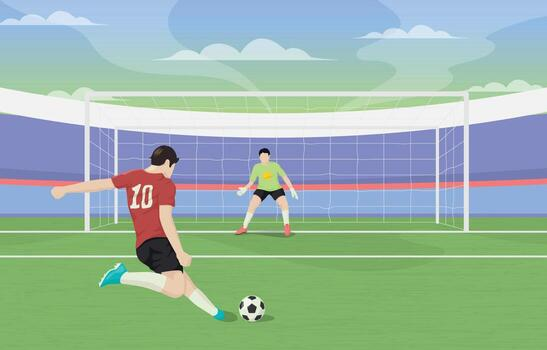

## **Introduction**

The data is sourced from StatsBomb's Open Data repository via their R package. It contains highly detailed, event-level data for various soccer competitions, including every pass, shot, tackle, and defensive action recorded during matches. For this analysis, we are specifically filtering the data to look at UEFA Champions League matches.

* A link to the data repository [StatsBomb Open Data on GitHub](https://github.com/statsbomb/open-data)

**Limitations**: StatsBomb's free tier only releases the Champions League Final from each season, rather than every match played. This means our analysis is based on a small sample of matches rather than a fuull season of games.

## **Questions**

**Main Question**: What factors influence winning in professional soccer matches? 


  * *Which players were caught in an offside position the most frequently?*
  
  * *Does defensive maneuvers (tackles, pressures, interceptions, etc.) correlate with winning?*
  * *Does playing at home provide a measurable advantage?*
  * *What is the average score per match, and how are goals distributed between home and away teams?*
  
  * *Where on the field do Champion League shots mostly originate from, and how does the score rate chance across different zones?*
  * *How does shot quality (xG) drop as shot distance from goal increases?*
  * *What are the score rates of penalty kicks?*

## **Key Terms for Unfiltered Data & Filtered Data**

* `player.name`: Name of the primary player involved in the event

* `type.name`: The primary category of the event (e.g., "Pass", "Offside", "Shot", "Tackle", "Pressure")

* `team.name`: The team responsible for a given event

* `location`: A list with x and y coordinates (0-120 long, 0-80 wide) marking where the event occurred on the field

* `shot.outcome.name`: The result of a shot (e.g., "Goal", "Saved", "Off T", "Post")

* `shot.statsbomb_xg`: Expected goals — probability (0 to 1) that a shot becomes a goal based on location and context

* `shot.body_part.name`: The body part used for a shot (e.g., "Right Foot", "Left Foot")

* `shot.type.name`: Context of the shot (e.g., "Open Play", "Penalty", "Free Kick")

* `home_score` / `away_score`: Final goals scored by the home and away teams

* `pass.outcome.name` / `pass.recipient.name`: Used to identify offside calls during passes


## **Key Values and Calculations:**


```{r setup, include=FALSE}
knitr::opts_chunk$set(echo = TRUE, message = FALSE, warning = FALSE)
```

```{r, message=FALSE, warning=FALSE}
#install.packages("devtools")
#install.packages("remotes")
#devtools::install_github("statsbomb/StatsBombR")
#install.packages("ggsoccer")


library(tidyverse)
library(dplyr)
library(ggsoccer)

# Required packages by StatsBombR
library(stringi)
library(rvest)
library(RCurl)
library(foreach)
library(iterators)
library(parallel)
library(httr)
library(jsonlite)
library(sp)

library(StatsBombR)
```


```{r,results='hide'}
# Load all free competitions
invisible(capture.output(
  Comp <- FreeCompetitions()
  ))

champLeagues_Comp <- Comp %>% 
  filter(competition_name == "Champions League")

invisible(capture.output(
  Matches <- FreeMatches(champLeagues_Comp)
  ))

champLeagues_events <- list()

invisible(capture.output(
for (i in 1:nrow(Matches)) {
  match_data <- get.matchFree(Matches[i,])
  champLeagues_events[[i]] <- match_data
}
))

champLeagues_events <- bind_rows(champLeagues_events)
```

## **Most offside positions in the Champions League**

```{r 3, echo = FALSE}
offside_players <- champLeagues_events %>%
  filter(pass.outcome.name == "Pass Offside" | type.name == "Offside") %>%
  mutate(offside_player = ifelse(type.name == "Pass", pass.recipient.name, player.name)) %>%
  filter(!is.na(offside_player)) %>%
  group_by(offside_player) %>%
  summarise(offside_count = n(), .groups = 'drop') %>%
  arrange(desc(offside_count))

head(offside_players, 10)

top_10_offsides <- head(offside_players, 10)

ggplot(top_10_offsides, aes(x = reorder(offside_player, offside_count), y = offside_count)) +
  geom_bar(stat = "identity", fill = "#0E1E5B", width = 0.7) +
  coord_flip() +
  labs(
    title = "Most Offsides in the Champions League",
    subtitle = "Players caught in an offside position",
    x = "Player",
    y = "Number of Offsides"
  ) +
  theme_minimal()
```

## **Average Goals per Match: Home vs. Away**

```{r 4, echo = FALSE}
Matches <- Matches %>%  
  mutate(total_goals = home_score + away_score)

avg_total_goals <- mean(Matches$total_goals, na.rm = T)
avg_home_goals <- mean(Matches$home_score, na.rm = T)
avg_away_goals <- mean(Matches$away_score, na.rm = T)

print(paste("Average total goals per match:", round(avg_total_goals, 2)))
print(paste("Average home team goals:", round(avg_home_goals, 2)))
print(paste("Average away team goals:", round(avg_away_goals, 2)))

ggplot(Matches, aes(x = home_score, y = away_score)) +
  geom_jitter(width = 0.2, height = 0.2, alpha = 0.6, color = "blue", size = 3) +
  geom_abline(intercept = 0, slope = 1, linetype = "dashed", color = "black") +
  
  geom_abline(intercept = 0, slope = 0.5, linetype = "dashed", color = "green", size = 1) +
  geom_abline(intercept = 0, slope = 2, linetype = "dashed", color = "red", size = 1) +
  
  labs(
    title = "Match Results: Home Goals vs. Away Goals",
    subtitle = "Black line = Draw | Green line = Slope 0.5 | Red line = Slope 2",
    x = "Home Team Goals",
    y = "Away Team Goals"
  ) +
  
  coord_fixed(ratio = 1) +
  theme_minimal() +
  theme(plot.title = element_text(size = 14, face = "bold"))
```


## **Does Defense Win More Games?**

#To determine if defense correlates with winning, we can measure the volume of defensive actions a team performs in a match (Tackles, Interceptions, Clearances, Blocks, and Pressures) and compare it to the match outcome.

```{r defense-analysis, warning=FALSE, message=FALSE, echo = FALSE}
defensive_events <- champLeagues_events %>%
  filter(type.name %in% c("Pressure", "Tackle", "Interception", "Clearance", "Block")) %>%
  group_by(match_id, team.name) %>%
  summarise(defensive_actions = n(), .groups = 'drop')

team_match_outcomes <- bind_rows(
  Matches %>% select(match_id, team.name = home_team.home_team_name,
                     goals_for = home_score, goals_against = away_score),
  Matches %>% select(match_id, team.name = away_team.away_team_name,
                     goals_for = away_score, goals_against = home_score)
) %>% mutate(outcome = case_when(
    goals_for > goals_against ~ "Win",
    goals_for < goals_against ~ "Loss",
    T ~ "Draw"
  ))

team_match_outcomes %>%
  inner_join(defensive_events, by = c("match_id", "team.name")) %>%
  group_by(outcome) %>%
  summarise(avg_actions = mean(defensive_actions, na.rm = T), .groups = 'drop') %>%
  mutate(outcome = factor(outcome, levels = c("Loss", "Draw", "Win"))) %>%
  ggplot(aes(x = outcome, y = avg_actions, fill = outcome)) +
  geom_bar(stat = "identity", width = 0.6) +
  geom_text(aes(label = round(avg_actions, 1)), vjust = -0.5, size = 3, fontface = "bold") +
  scale_fill_manual(values = c("Win" = "green", "Draw" = "blue", "Loss" = "red")) +
  labs(
    title = "Average Defensive Actions by Match Outcome",
    subtitle = "Tackles, Interceptions, Clearances, Blocks, and Pressures combined",
    x = "Match Outcome", y = "Average Defensive Actions"
  ) +
  theme_minimal() +
  theme(legend.position = "none", plot.title = element_text(size = 14, face = "bold"))
```


## **Does being on a home field gives an advantage?** 

```{r}
# Step 1: filter out 
matches_clean <- Matches %>%
 select(match_id,
         home_team.home_team_name,
         away_team.away_team_name,
         home_score,
         away_score)

# Step 2: Label who win each match
matches_results <- matches_clean %>%
 mutate(
    result = case_when(
      home_score > away_score ~ "Home Win",
      home_score < away_score ~ "Away Win",
      TRUE ~ "Draw"
    )
 )

# Step 3: Count outcomes
home_away_counts <- matches_results %>%
 group_by(result) %>%
 summarise(count = n())

# Step 4:show results 
barplot(home_away_counts$count,
        names.arg = home_away_counts$result,
        col = c("#006400", "#1E88E5", "#FF8C00"),
        main = "Home vs Away Advantage",
        ylab = "Number of Matches")
```

## **Does defense win more games?**

```{r}
# Step 1: Measure Defensive Performance

ga <- champLeagues_events %>%
 filter(type.name == "Shot", shot.outcome.name == "Goal") %>%
 group_by(team.name) %>%
 summarise(ga = n()) %>%
 arrange(ga)
```

```{r}
# Step 2: Count Team Wins

wins <- matches_results %>%
 mutate(w = case_when(
    result == "Home Win" ~ home_team.home_team_name,
    result == "Away Win" ~ away_team.away_team_name,
    
 )) %>%
 filter(!is.na(w)) %>%
 group_by(w) %>%
 summarise(wins = n())
```

```{r}
# Step 3: link Defense and Wins

df <- ga %>%
 rename(team = team.name) %>%
 inner_join(wins, by = c("team" = "w"))
```

```{r}
# Step 4 : Graph

df2 <- df %>%
 filter(wins < 100)

plot(df2$ga, df2$wins,
     xlab = "Goals Allowed",
     ylab = "Wins",
     main = "Defense vs Wins")

```

## **Whats the average score per match ?**

```{r}
#step 1: Get total goals per match

ms <- matches_clean %>%
 mutate(tg = home_score + away_score)
```

```{r}
# Step 2: Find the average

avg_g <- mean(ms$tg, na.rm = TRUE)
avg_g
```
```{r, echo = FALSE}
# Step 3: Graph it 
hist(ms$tg,
     xlab = "Goals per Match",
     main = "Match Scores")
abline(v = avg_g)
```


## **Penalty Shot Analysis**



```{r, echo = FALSE}
champLeagues_shots <- 
  champLeagues_events %>% 
  filter(type.name == "Shot") %>% 
  select(id, match_id, competition_id, season_id, index, period, timestamp, minute, second, possession, duration, location, under_pressure, out, team.id, team.name, player.id, player.name, position.id, position.name, shot.end_location, shot.first_time, shot.aerial_won, shot.technique.id, shot.technique.name, shot.body_part.id, shot.body_part.name, shot.type.id, shot.type.name, shot.statsbomb_xg, shot.outcome.id, shot.outcome.name)

champLeagues_penalty_shots <- champLeagues_shots %>% filter(shot.type.name == "Penalty")


```

## **Penalty Shot Analysis Overview**


```{r, echo = FALSE}
penalty_summary <- champLeagues_penalty_shots %>%
  summarise(
    total_penalties = n(),
    Goals_Scored = sum(shot.outcome.name == "Goal"),
    Off_Target = sum(shot.outcome.name == "Off T"),
    Shots_Post = sum(shot.outcome.name == "Post"),
    Shots_Saved = sum(shot.outcome.name == "Saved"),
    Scoring_Rate = round((sum(shot.outcome.name == "Goal") / n()) * 100, 1)
  )

print(penalty_summary)
```
```{r, echo = FALSE}
ggplot(champLeagues_penalty_shots, aes(x = shot.outcome.name, fill = shot.outcome.name)) +
  geom_bar(width = .8, show.legend = FALSE) +
  scale_fill_manual(values = c("Goal" = "springgreen3",
                    "Off T" = "red",
                    "Post" = "orange",
                    "Saved" = "steelblue"))+
  labs(title = "Penalty Shot Outcomes",
       x = "Outcome",
       y = "Count") +
  theme_minimal() +
  theme(legend.position = "none")

```

## **Penalty Shot Analysis - Body Part**

```{r, echo = FALSE}
body_part_analysis <- champLeagues_penalty_shots %>%
  filter(!is.na(shot.body_part.name)) %>%
  group_by(shot.body_part.name) %>%
  summarize(
    Total = n(),
    Goals = sum(shot.outcome.name == "Goal"),
    Score_Rate = round((Goals / Total) * 100, 1),
    .groups = 'drop'
  ) %>%
  arrange(desc(Score_Rate))
 
print(body_part_analysis)

```

```{r, echo = FALSE}

body_part_analysis %>% ggplot(aes(x = shot.body_part.name, 
                               y = Score_Rate, fill = shot.body_part.name)) +
  geom_col(width = 0.5) +
  coord_flip() +
  scale_fill_manual(values = c("Right Foot" = "springgreen3", 
                               "Left Foot" = "red3")) +
  labs(
    title = "Penalty Score Rate by Body Part",
    x = "Body Part Used",
    y = "Score Rate (%)",
    fill = "Score %"
  ) +
  theme_minimal() +
  theme(
    legend.position = "none",
    plot.title = element_text(size = 14, face = "bold")
  )
```

```{r, echo = FALSE}
body_part_outcome <- champLeagues_penalty_shots %>%
  filter(!is.na(shot.body_part.name)) %>%
  group_by(shot.body_part.name, shot.outcome.name) %>%
  count() %>%
  ungroup()
 
print(body_part_outcome)
```

## **Shots On The Goal**

```{r, echo = FALSE}
champLeagues_shots_xy <- champLeagues_shots %>%
  filter(!is.na(location)) %>%
  mutate(
    x = map_dbl(location, 1), # x-coordinate (0-120 facing direction of attack)
    y = map_dbl(location, 2), # y-coordinate (0-80, width of field)
    is_goal = shot.outcome.name == "Goal" 
  ) %>%
  filter(shot.type.name != "Penalty")


```

```{r, echo = FALSE}
get_distance_band <- Vectorize(function(x) {
  if (x >= 102){
    "Inside the Box"
  }else if (x >= 84) {
    "Edge of the Box (18-36 yds)"
  }else if (x >= 72) {
    "Long Range (36-48 yds)"
  }else {
    "Very Long Range (48+ yds)"
  }
})

get_lateral_zone <- Vectorize(function(y) {
  if (y >= 30 & y <= 50) {
    "Central"
  }else if (y < 30){
    "Right Side"
  }else if (y > 50) {
    "Left Side"
    } 
})

field_zones <- champLeagues_shots_xy %>%
  filter(x >= 60) %>%  # attacking half only
  mutate(
    distance_band = get_distance_band(x),
    lateral_zone = get_lateral_zone(y)) %>%
  group_by(distance_band, lateral_zone) %>%
  summarise(
    total_shots     = n(),
    goals           = sum(is_goal, na.rm = TRUE),
    score_rate = round(goals / total_shots * 100, 1),
    .groups = "drop"
  ) %>%
  arrange(distance_band, desc(score_rate))

field_zones
```

```{r, echo = FALSE}
all_shots <- champLeagues_shots_xy
shot_goals <- champLeagues_shots_xy %>% filter(is_goal == TRUE)

ggplot()+
  annotate_pitch(dimensions = pitch_statsbomb)+
  theme_pitch()+
  coord_flip(xlim = c(60,120),
             ylim = c(0,80)) +
  geom_point(data = all_shots,
             aes(x = x, y = y),
             color = "gray", alpha = 0.5) +
  geom_point(data = shot_goals,
             aes(x = x, y = y),
             shape = 21, fill ="red") +
 labs(title = "Champions League Shot Map",
      subtitle = "Goals highlighted in red")
```


## **xG vs Shot Distance**

```{r, echo = FALSE}
xg_distance_data <- champLeagues_shots_xy %>%
  filter(shot.type.name != "Penalty") %>%
  mutate(
    distance_to_goal = sqrt((120 - x)^2 + (40 - y)^2),
    outcome = ifelse(is_goal == TRUE, "Goal", "Miss/Save")
  )

ggplot(xg_distance_data, 
       aes(x = distance_to_goal, 
           y = shot.statsbomb_xg)) +
  geom_point(aes(color = outcome), 
             alpha = 0.5, size = 2) +
  geom_smooth(method = "loess", color = "steelblue") +
  scale_color_manual(values = c("Goal" = "red", "Miss/Save" = "skyblue")) +
  labs(x = "Distance to Goal (yards)",
       y = "Expected Goals (xG)")
  
```

## Conclusion 

So, what factors influence winning in professional soccer matches?

Shot location matters the most! Scoring rates increase drastically inside the box and in central zones, while xG drops steeply as distance from goal increases. 

Home advantage is unclear. In our analysis, home teams win more often than away teams, but the gap is modest. However, our sample size is small and is not enough information to confidently conclude whether home-field advantage meaningfully influences winning in professional soccer.

Penalties are the single highest-probability scoring opportunity, which shows how important it is to draw fouls inside the box

## Resources

 * [StatsBomb Documentation](https://github.com/statsbomb/open-data)

 * [StatsBombR GitHub](https://github.com/statsbomb/open-data)

 * [ggplot Soccer Map](https://biscuitchaserfc.substack.com/p/shot-maps-in-r-with-statsbomb-data)
 
